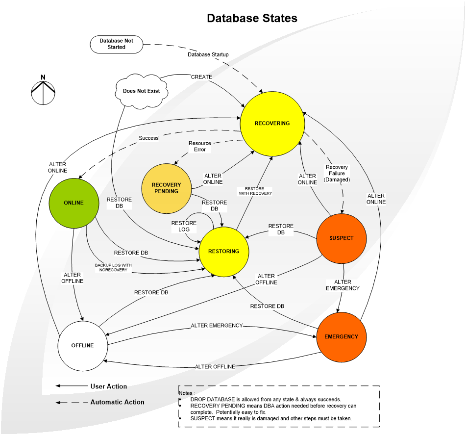

# SQLStartupFSM

FSM(Finite State Machine) is an abstract machine that can be in exactly one of a finite number of states at any given time. The FSM can change from one state to another in response to some inputs; the change from one state to another is called a transition. An FSM is defined by a list of its states, its initial state, and the inputs that trigger each transition. 

In this repo, we used a simple .NET core-based console FSM to demonstrate SQL Start up state transition.

## Using SQLStartupFSM

You can simply `git clone` this project to get started. It is recommended that you don't preserve history of the project (it isn't generally meaningful) for your repo, but make a copy and `git init` your project from source.

## Building

1. Install VSCode or Visual Studio with .NET Core 6.
2. Clone this repo and use VSCode or Visual Studio to open the project.
3. For VSCode, Use F5 to run this sample.
4. Input the Event Number to triger the transition or q/esc to leave the SQLStartupFSM.

## Contributing

See [CONTRIBUTING.md](CONTRIBUTING.md) for information on contributing to this project.

This project has adopted the code of conduct defined by the [Contributor Covenant](http://contributor-covenant.org/) 
to clarify expected behavior in our community. For more information, see the [.NET Foundation Code of Conduct](http://www.dotnetfoundation.org/code-of-conduct).

## License

This project is licensed with the [MIT license](LICENSE).